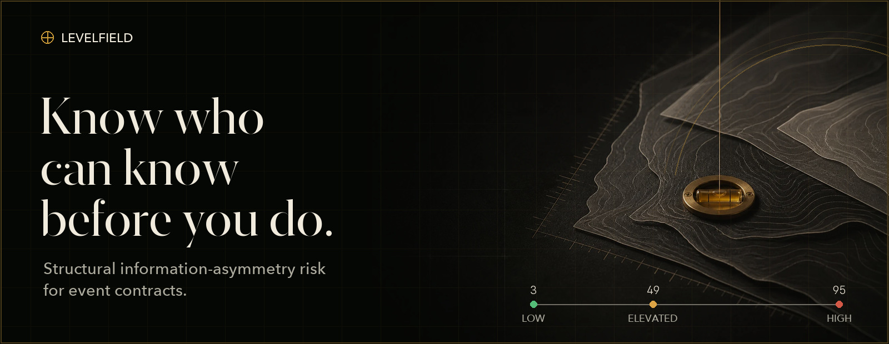
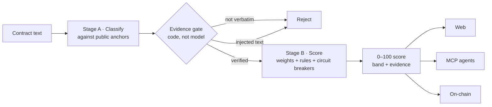
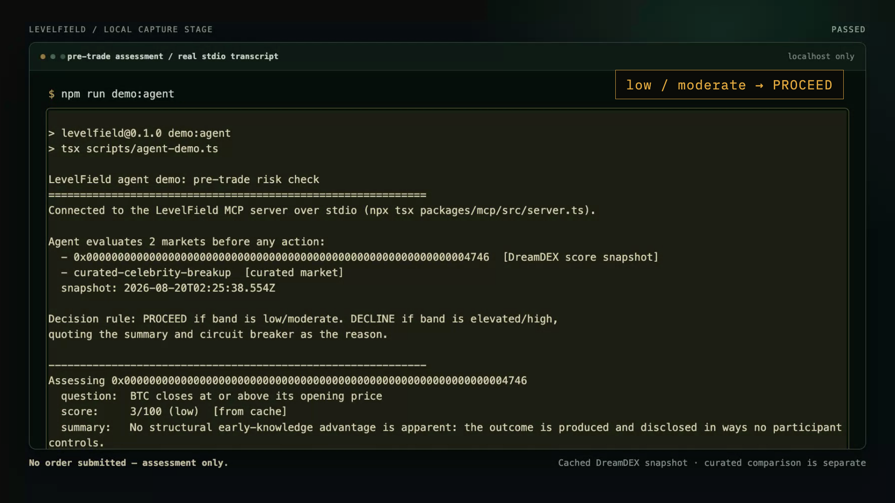

<div align="center">

<a href="https://levelfield.vercel.app">
  
</a>

<br />
<br />

[](https://levelfield.vercel.app)
[](https://youtu.be/XDMKRzUT_nI)
[](demo-deck/levelfield-deck.pdf)

**Structural information-asymmetry risk for event contracts.**<br />
Scored from contract text · verified by code · attested on-chain.

[](#proof-not-promises)
[](docs/validation.md)
[](https://shannon-explorer.somnia.network/address/0xb8e11dea346f2c961880879606a269db3165bbc7)
[](#three-classification-tracks)
[](LICENSE)

[Why LevelField](#why-levelfield) · [How it works](#how-it-works) · [Run locally](#run-it-in-three-commands) · [MCP](#agents-ask-first) · [Validation](#proof-not-promises)

</div>

---

## Why LevelField

A market price tells you what the crowd believes. It does **not** tell you who may already
know the outcome — whether an event is made by someone, known early by a few, and tradable
by exactly those people.

LevelField turns that hidden structure into one auditable **0–100 risk score** before a trade
is placed. It predicts nothing, accuses no one, and needs no live-behavior surveillance. It
scores the shape of the field from the contract itself.

<table>
<tr>
<td width="33%" valign="top">

### ◇ Inspectable
Every score ships with contract-exact evidence and five dimension-level explanations.

</td>
<td width="33%" valign="top">

### ◇ Deterministic
A model may classify text. Only unit-tested code applies weights, rules, and circuit breakers.

</td>
<td width="33%" valign="top">

### ◇ Portable
Use the web UI, let an agent query the MCP server, or verify an immutable on-chain attestation.

</td>
</tr>
</table>

## Change nothing but the event

<table>
<tr>
<td width="50%" align="center">
  <a href="https://levelfield.vercel.app"></a>
</td>
<td width="50%" align="center">
  <a href="https://levelfield.vercel.app/market/curated-celebrity-breakup"></a>
</td>
</tr>
<tr>
<td valign="top">

### `03 / 100` · Low
A real DreamDEX BTC price binary. No participant controls the global reference price, and disclosure is near-simultaneous.

</td>
<td valign="top">

### `95 / 100` · High
A contract settled by one person's private decision, with nothing preventing that person from trading on it.

</td>
</tr>
</table>

<div align="center">

**Same engine. Same public rules. The gap is the product.**

</div>

## Run it in three commands

> **Requirements:** Node.js ≥ 20.9. No API key. No wallet. No configuration.

```bash
npm install && npm test
npm run demo:agent
npm run validate
```

| Command | What you will see |
|---|---|
| `npm test` | 70 software tests across scoring and web |
| `npm run demo:agent` | An MCP-connected agent **PROCEED** at 3 and **DECLINE** at 95 |
| `npm run validate` | 16-contract category ordering and **Spearman ρ = 0.930** |

## How it works



> [!IMPORTANT]
> **No model ever writes the number.** A model only maps contract language to a fixed,
> public [anchor library](data/anchors/anchors.yaml). Deterministic code performs every
> numeric operation.

| | Dimension | Weight | Question answered |
|:-:|---|:-:|---|
| **D1** | Outcome Control | **30%** | What produces the outcome: a natural process, an institution, or one person's will? |
| **D3** | Insider Tradability | **25%** | Can the people who know early trade on that knowledge? |
| **D2** | Knowledge Circle | **20%** | How many people can know before public disclosure? |
| **D4** | Disclosure Synchronicity | **15%** | Does everyone learn the outcome at roughly the same time? |
| **D5** | Outcome Manufacturability | **10%** | Could someone cause the outcome in order to win the bet? |

Weighted levels become a score from 0–100 and one of four bands:

```
LOW  ───────── 25 ── MODERATE ── 50 ── ELEVATED ── 75 ───────── HIGH
```

Graduated **circuit breakers** prevent dangerous combinations from being averaged away.
One person controlling an outcome they can freely trade floors the result at **80**, **90**,
or **95**. Missing information defaults conservatively to level 4 and is flagged — ambiguity
never earns a low score.

The taxonomy follows the outcome-maker classification validated by the Anti-Corruption Data
Collective across 435,000+ settled Polymarket markets. LevelField reproduces the gradient
end-to-end: **3** price binaries → **19–21** statistics and elections → **49** FOMC → **65**
layoffs → **78** military action → **80–95** individual will.

### Three classification tracks

| Track | Stage A provider | Best for |
|---|---|---|
| **Live DreamDEX** | Deterministic rules over typed on-chain fields | Fast checks where question text never needs parsing |
| **Curated spectrum** | Auditable [reference classifications](data/classifications/) | Reproducible validation and demonstrations |
| **Any contract** | Your agent's own model via the [MCP server](packages/mcp/) | New, unstructured event-contract text |

None calls a paid LLM API.

## Defense by construction

| A market creator tries to… | LevelField responds… |
|---|---|
| Talk a model into a low score | Every evidence quote must be a machine-verified verbatim substring of the contract |
| Smuggle instructions into the contract | A model-independent scanner taints assessor-directed text and rejects evidence drawn from it |
| Win by withholding information | Missing information scores level 4 and is explicitly surfaced |

Try the defense on the live [injection-test contract](https://levelfield.vercel.app/market/curated-injection-test).

## Agents ask first

Any trading agent can call LevelField's stdio [MCP server](packages/mcp/) before placing an
order. The default policy fits in one line:

```text
low / moderate  →  PROCEED
elevated / high →  DECLINE
```

The MCP server has zero LLM dependencies and requires no key. The **calling agent's own
model** performs classification; LevelField independently verifies its evidence and computes
the result.

<p align="center">
  
</p>

## Scores that outlive the website

Every current score is published to the source-verified
[**ScoreRegistry**](https://shannon-explorer.somnia.network/address/0xb8e11dea346f2c961880879606a269db3165bbc7)
on Somnia Shannon. Each attestation stores:

- the risk band and all five dimension levels;
- a method hash pinning the exact anchor-library version;
- an immutable source URI pinned to commit [`ea725e2`](https://github.com/Aji-Q/levelfield/tree/ea725e2b3e63427d8201ccf5f6b1daf26bd21238).

`npm run verify:onchain` reads every field back and fails closed on missing or changed data.
Current result: **26 / 26 attestations verified, zero mismatches**.

## Proof, not promises

<div align="center">

| `ρ = 0.930` | `16 / 16` | `70 + 8` | `26 / 26` |
|:-:|:-:|:-:|:-:|
| Spearman category order | majority band matches reference | software + contract tests | attestations verified |

</div>

```bash
npm test && npm run validate && npm run agreement && npx tsx scripts/verify-classifications.ts
```

The honest limit: this is a 16-contract curated corpus. Agreement statistics are published
per dimension in [validation](docs/validation.md) and [agreement](docs/agreement.md), and no
outcome-prediction claim is made.

## Repository map

```text
packages/scoring/   two-stage pipeline · anchors · voting · engine · DreamDEX fetcher
packages/mcp/       zero-LLM-dependency MCP server · protocol · verification · scoring
apps/web/           Next.js UI · markets · evidence · methodology
contracts/          ScoreRegistry.sol · Foundry tests · Shannon deployment
data/               anchor library · contracts · classifications · score cache
demo-video/         2:55 product film · Remotion source
docs/               validation · agreement · design notes · integration findings
```

<details>
<summary><b>Full command reference</b></summary>

```bash
npm install
npm test                                  # all workspaces
npm run demo:agent                        # MCP pre-trade check: PROCEED 3, DECLINE 95
npm run validate                          # ordering checks + Spearman rho
npm run agreement                         # 3 blind runs vs reference
npm run score:all                         # rescore live testnet + curated data
npm run dev -w @levelfield/web            # UI at localhost:3000
npm run mcp                               # stdio MCP server
npx tsx scripts/verify-classifications.ts # verify every evidence quote
GITHUB_REPO=Aji-Q/levelfield GITHUB_REF=<sha> npm run verify:onchain
cd contracts && forge test                # 8 smart-contract tests
```

</details>

---

<div align="center">


Built for the **Somnia × DreamDEX Event Contracts Hackathon** · [MIT License](LICENSE)

**[Launch LevelField](https://levelfield.vercel.app)** · **[Watch the film](https://youtu.be/XDMKRzUT_nI)** · **[Explore the registry](https://shannon-explorer.somnia.network/address/0xb8e11dea346f2c961880879606a269db3165bbc7)**

*Know who can know — before you do.*

</div>
