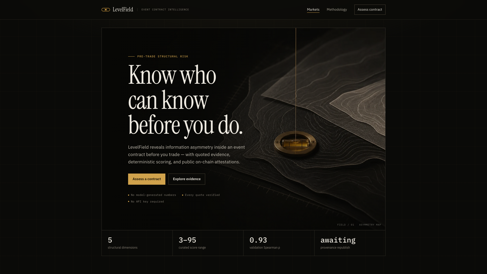
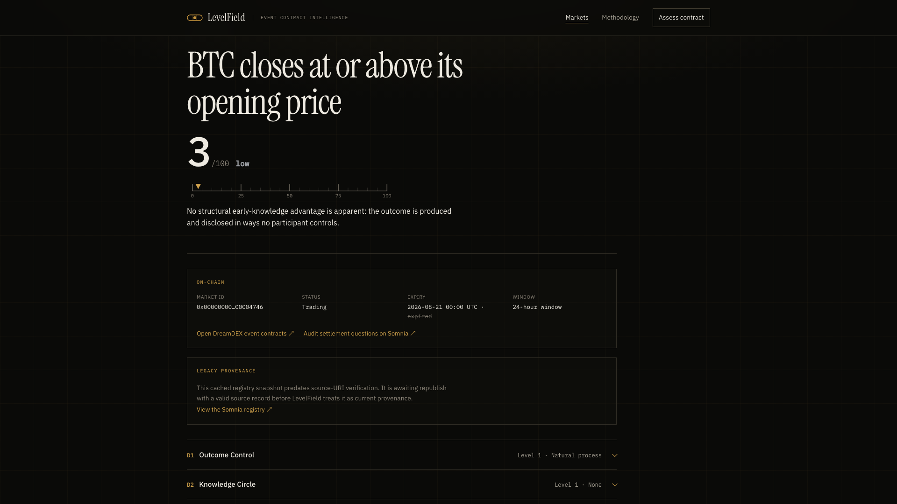
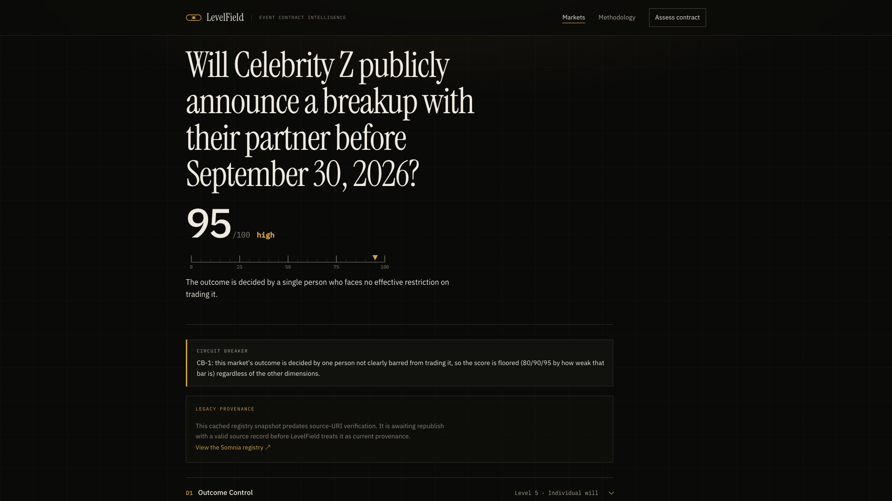
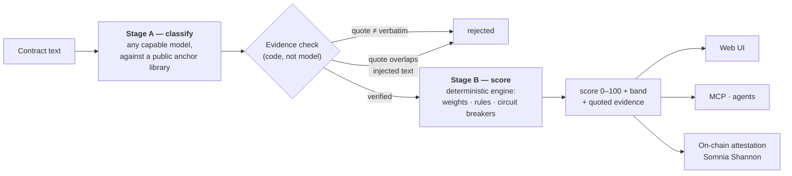

<div align="center">


# LevelField

**Know who can know — before you do.**

Structural information-asymmetry risk for event contracts —
scored from the contract text alone, verified by code, attested on-chain.

[](#numbers-a-judge-can-re-run)
[](docs/validation.md)
[](https://shannon-explorer.somnia.network/address/0xb8e11dea346f2c961880879606a269db3165bbc7)
[](#three-ways-to-classify)
[](LICENSE)

**[Live site](https://levelfield.vercel.app)** · **[Demo video · 2:55](https://youtu.be/XDMKRzUT_nI)** · **[Deck](demo-deck/levelfield-deck.pdf)** · **[ScoreRegistry ↗](https://shannon-explorer.somnia.network/address/0xb8e11dea346f2c961880879606a269db3165bbc7)**

<br/>

<a href="https://levelfield.vercel.app"></a>

</div>

A price tells you what the crowd believes. It doesn't tell you **who could already know** —
whether this event's outcome is *made* by someone, *known early* by a few, and *tradable* by
exactly those people. LevelField reads that structure out of the contract itself and turns it
into one auditable number. It predicts nothing, accuses no one, and detects nothing live —
it scores the shape of the field before you step onto it.

## Change nothing but the event

|  |  |
|:--|:--|
| **3 / 100 · low** — a real DreamDEX BTC price binary. No participant controls a global reference price; disclosure is near-simultaneous. | **95 / 100 · high** — a curated contract that settles on one person's private decision, with nothing stopping them from trading on it. |

Same engine. Same rules. The gap **is** the product.

## Judge it in three commands

Node ≥ 20.9 — no API key, no wallet, nothing to configure.

```bash
npm install && npm test        # 70 software tests
npm run demo:agent             # an agent asks the MCP server before acting: PROCEED at 3, DECLINE at 95
npm run validate               # 16-contract validation: category order + Spearman rho = 0.930
```

## How a score is made



**No model ever writes the number.** A model only *classifies* — matching the contract against
a fixed, public [anchor library](data/anchors/anchors.yaml) on five dimensions. Deterministic,
unit-tested code does everything numeric.

| | Dimension | Weight | The question it answers |
|--|-----------|:-:|------------------------|
| **D1** | Outcome Control | 30% | What produces the outcome — natural process… one person's will? |
| **D3** | Insider Tradability | 25% | Can the people who know early actually trade on it? |
| **D2** | Knowledge Circle | 20% | How many people know before disclosure? |
| **D4** | Disclosure Synchronicity | 15% | Does everyone learn the outcome at once? |
| **D5** | Outcome Manufacturability | 10% | Could someone *cause* the outcome to win a bet? |

Weighted levels → 0–100 → band (`low < 25 ≤ moderate < 50 ≤ elevated < 75 ≤ high`), with
graduated **circuit breakers**: one person controlling an outcome they can freely trade floors
the score at 80/90/95 no matter what the other dimensions say. Ambiguity never scores low —
an undeterminable dimension defaults conservatively to level 4 and is flagged.

The taxonomy follows the outcome-maker classification the Anti-Corruption Data Collective
validated across 435,000+ settled Polymarket markets; our pipeline reproduces that risk
gradient end-to-end: **3** (price binaries) → **19–21** (statistics, elections) → **49** (FOMC)
→ **65** (layoffs) → **78** (military) → **80–95** (individual will).

### Three ways to classify

None of them calls a paid API.

| Track | Stage A provider |
|-------|------------------|
| Live DreamDEX markets | Deterministic rules over **typed on-chain fields** — question text is never parsed |
| Curated risk spectrum | [Reference classifications](data/classifications/) produced once via the open protocol, auditable in git |
| Any contract text | **Your agent's own model**, via the [MCP server](packages/mcp/) — it hands out the protocol, verifies quotes, computes the score |

### What a market creator cannot do

- **Talk a model into a low score** — every evidence quote must be a verbatim substring of the
  contract, machine-checked.
- **Smuggle instructions into the contract** — a code-level scanner (independent of any model)
  detects text addressed at automated assessors, taints those sentences, and rejects any quote
  drawn from them. Try it on the [injection-test contract](https://levelfield.vercel.app/market/curated-injection-test).
- **Win by withholding information** — missing information scores level 4, never low.

## Agents ask first

Any trading agent calls the LevelField MCP server over stdio before placing an order.
The policy fits in one line: **low / moderate → PROCEED · elevated / high → DECLINE**, with the
evidence attached to the refusal. The server has zero LLM dependencies and needs no key —
the *calling agent's own model* does the classification; the server verifies and computes.

## Scores that outlive the website

Every current score is published to the source-verified
[**ScoreRegistry**](https://shannon-explorer.somnia.network/address/0xb8e11dea346f2c961880879606a269db3165bbc7)
on Somnia Shannon: band, five dimension levels, a method hash pinning the exact anchor-library
version, and an immutable source URI pinned to commit
[`ea725e2`](https://github.com/Aji-Q/levelfield/tree/ea725e2b3e63427d8201ccf5f6b1daf26bd21238)
of this repo. `npm run verify:onchain` reads every field back and fails closed on anything
missing or changed — currently **26/26, zero mismatches**.

## Numbers a judge can re-run

| ρ = 0.930 | 16 / 16 | 70 + 8 | 26 / 26 |
|:-:|:-:|:-:|:-:|
| Spearman, category risk order (n = 16) | blind-run majority band = reference, 3 independent runs | software + smart-contract tests | on-chain attestations verified field-by-field |

```bash
npm test && npm run validate && npm run agreement && npx tsx scripts/verify-classifications.ts
```

Honest limits: a 16-contract curated corpus, agreement statistics published per dimension
([validation](docs/validation.md) · [agreement](docs/agreement.md)); no outcome prediction claimed.

## Repository map

```
packages/scoring/    two-stage pipeline: anchors, classifiers, voting, engine, DreamDEX fetcher
packages/mcp/        MCP server — protocol, verification, scoring; zero LLM deps
apps/web/            Next.js UI: markets, evidence, methodology  →  levelfield.vercel.app
contracts/           ScoreRegistry.sol (Foundry), deployed + source-verified on Shannon
data/                anchor library · curated contracts · reference classifications · score cache
demo-video/          the 2:55 film and the Remotion project that renders it
docs/                validation · agreement · SDK feedback report · integration notes
FEEDBACK.md          11 evidence-backed SDK & docs findings from real integration
```

<details>
<summary><b>Full command reference</b></summary>

```bash
npm install
npm test                       # all workspaces
npm run demo:agent             # agent → MCP pre-trade check (PROCEED 3/100, DECLINE 95/100)
npm run validate               # ordering checks + Spearman rho  → docs/validation.md
npm run agreement              # 3 blind runs vs reference       → docs/agreement.md
npm run score:all              # rescore live testnet + curated  → data/scores/
npm run dev -w @levelfield/web # UI at localhost:3000
npm run mcp                    # stdio MCP server (see packages/mcp/README.md)
npx tsx scripts/verify-classifications.ts   # re-verify every evidence quote
GITHUB_REPO=Aji-Q/levelfield GITHUB_REF=<sha> npm run verify:onchain
cd contracts && forge test     # 8 smart-contract tests
```

</details>

---

<div align="center">

Built for the **Somnia × DreamDEX Event Contracts Hackathon** · MIT License

*Know who can know — before you do.*

</div>
